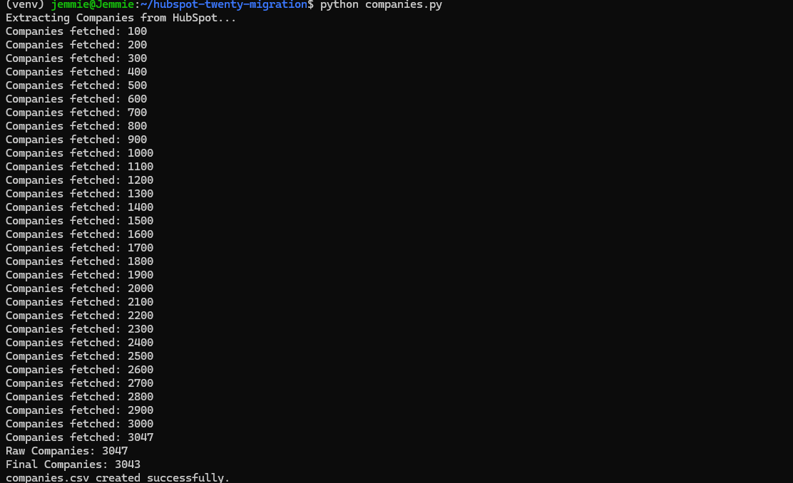
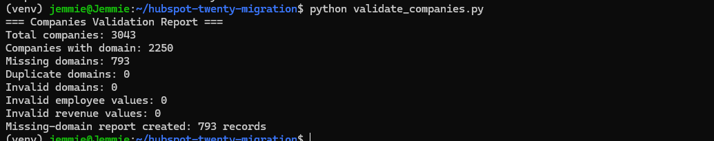
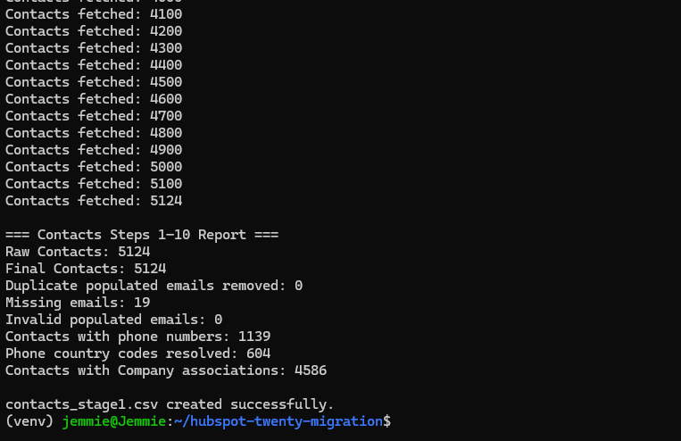
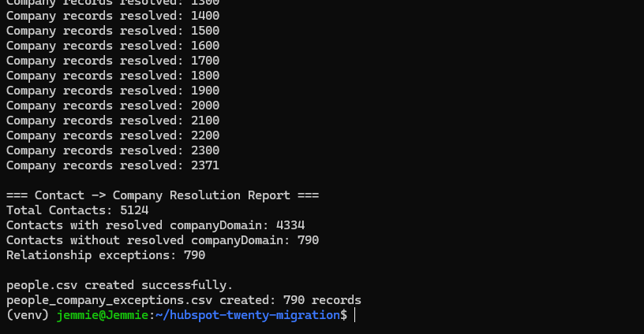
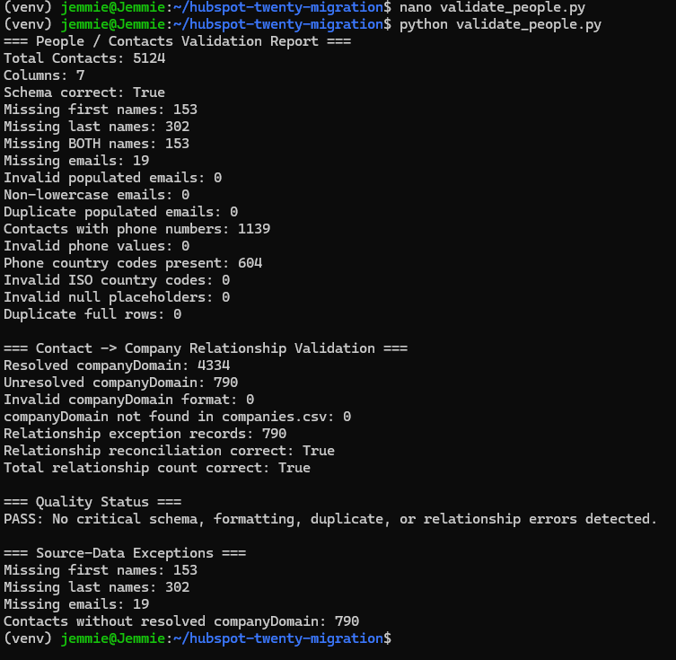
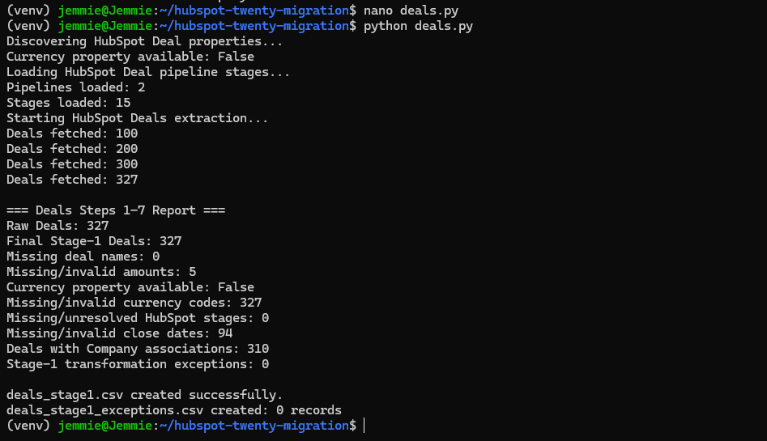
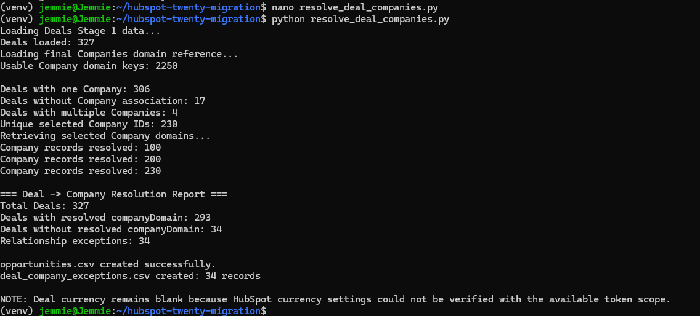
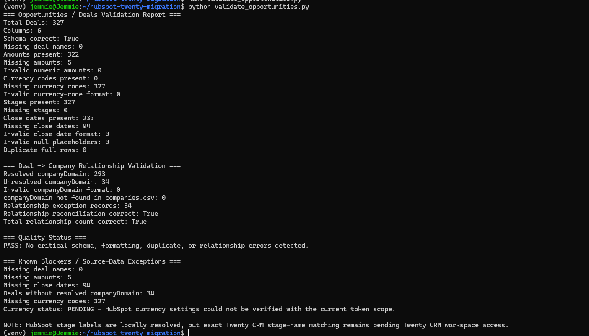

# HubSpot → Twenty CRM Data Migration

A validation-first CRM migration workflow that extracts, transforms, reconciles, and validates **Companies, Contacts, and Deals** from HubSpot for migration into Twenty CRM.

The workflow emphasizes **data integrity, relationship accuracy, reproducibility, exception handling, and secure credential management**.

---

## Architecture

```text
HubSpot CRM API
      ↓
Extract
      ↓
Transform & Normalize
      ↓
Resolve Relationships
      ↓
Validate & Reconcile
      ↓
Migration-Ready CSVs
      ↓
Twenty CRM
```

Relationships are resolved through the validated Company dataset:

```text
Contacts ─────► Companies ◄───── Deals
                    │
              companyDomain
```

---

## Tech Stack

`Python` • `HubSpot CRM API` • `Twenty CRM` • `CSV` • `Git/GitHub` • `WSL Ubuntu` • `VS Code`

Key Python libraries: `urllib`, `csv`, `Decimal`, `pycountry`, `python-dotenv`.

---

## Migration Results

| Dataset | Records | Relationship Result | Validation |
|---|---:|---|---|
| Companies | 3,047 → 3,043 | Canonical Company dataset | ✅ PASS |
| Contacts | 5,124 | 4,334 resolved / 790 exceptions | ✅ PASS |
| Deals | 327 | 293 resolved / 34 exceptions | ✅ PASS |

### Data Quality Highlights

**Companies**
- 0 duplicate domains
- 0 invalid domains
- 0 invalid website URLs

**Contacts**
- 5,124 records preserved
- 0 invalid populated emails
- 4,334 validated Company relationships
- 790 unresolved relationships documented

**Deals**
- 327 records preserved
- 0 invalid numeric amounts
- 0 invalid close-date formats
- 0 invalid Company-domain references
- 293 validated Company relationships
- 34 relationship exceptions

Deal reconciliation:

```text
293 resolved + 34 unresolved = 327 Deals
```

---

## Field Mapping

### Contacts → People

| HubSpot | Twenty CRM |
|---|---|
| `firstname` | `firstName` |
| `lastname` | `lastName` |
| `email` | `email` |
| `phone` | `Phones / Primary Phone Number` |
| Derived ISO code | `Phones / Primary Phone Country Code` |
| `jobtitle` | `jobTitle` |
| Company association | `companyDomain` |

### Deals → Opportunities

| HubSpot | Twenty CRM |
|---|---|
| `dealname` | `name` |
| `amount` | `amount / Amount` |
| Currency | `amount / Currency Code` |
| `dealstage` | `stage` |
| `closedate` | `closeDate` |
| Company association | `companyDomain` |

---

## Workflow & Commands

Activate the environment:

```bash
source venv/bin/activate
```

### Companies

```bash
python companies.py
python validate_companies.py
```

### Contacts

```bash
python contacts.py
python resolve_contact_companies.py
python validate_people.py
```

### Deals

```bash
python deals.py
python check_currency.py
python resolve_deal_companies.py
python validate_opportunities.py
```

The workflow follows:

```text
Extract → Transform → Resolve → Reconcile → Validate
```

Validation covers schema integrity, duplicates, numeric/date formats, null handling, domain integrity, and Contact/Deal → Company relationships.

Unresolved or missing source values are recorded as exceptions rather than fabricated.

---

## Outputs

```text
companies.csv
people.csv
opportunities.csv

people_company_exceptions.csv
deal_company_exceptions.csv
```

CRM CSV files are intentionally excluded from Git because they may contain company/customer data.

---

## Evidence

### Companies

**Extraction**



**Validation**



### Contacts / People

**Extraction**



**Company Relationship Resolution**



**Validation**



### Deals / Opportunities

**Extraction**



**Company Relationship Resolution**



**Validation**



---

## Security

Credentials are loaded through environment variables:

```python
TOKEN = os.getenv("HUBSPOT_ACCESS_TOKEN")
```

Sensitive/generated files are excluded through `.gitignore`:

```gitignore
.env
venv/
__pycache__/
*.csv
test_*.py
*_backup.py
```

No API credentials or CRM datasets are intentionally committed.

---

## Blockers & Exceptions

### HubSpot Currency Permission

The Deal schema did not expose a record-level currency property, while the currency-settings diagnostic returned:

```text
HTTP 403
```

The current token therefore cannot verify the account currency. All 327 currency values remain intentionally unset rather than guessed.

**Status:** ⚠️ Requires additional HubSpot currency-settings permission.

### Twenty CRM Access

Twenty CRM workspace access is still required for:

- exact Opportunity stage verification
- destination schema confirmation
- test import
- post-import relationship verification

**Status:** ⚠️ Access-dependent.

### Source-Data Exceptions

```text
Contacts:
19 missing emails
153 missing first names
302 missing last names
790 unresolved Company relationships

Deals:
5 missing amounts
94 missing close dates
34 unresolved Company relationships
```

These are documented source-data exceptions and are not silently replaced with synthetic values.

---

## Project Structure

```text
hubspot-twenty-migration/
├── companies.py
├── validate_companies.py
├── contacts.py
├── resolve_contact_companies.py
├── validate_people.py
├── deals.py
├── resolve_deal_companies.py
├── validate_opportunities.py
├── check_currency.py
├── evidence/
├── .gitignore
└── README.md
```

---

## Status

**Completed:** extraction, transformation, normalization, relationship resolution, exception handling, and independent local validation for Companies, Contacts, and Deals.

**Validation:** ✅ Critical local schema, formatting, duplicate, numeric, and referential-integrity checks passed.

**Pending:** ⚠️ HubSpot currency verification and Twenty CRM destination-side verification/import.

> **Engineering principle:** Never fabricate data to make a migration appear complete. Preserve exceptions, validate relationships, and keep every transformation traceable.

---

**Author:** Jemimah Godswill  
**Project:** HubSpot → Twenty CRM Data Migration